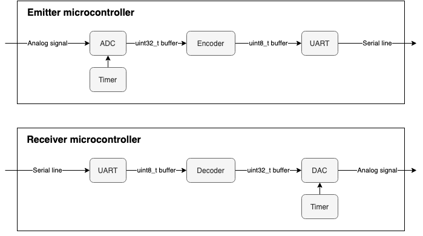

# MicroW - Digital components

## Overview

Every module (receiver and emitter) is equipped with a microcontroller that basically acts as a serial/analog converter (we use [STM32F429ZI](https://www.st.com/en/microcontrollers-microprocessors/stm32f429zi.html) microcontrollers). Radio transmission and encryption is performed by [Digi Xbee® S1 802.15.4 RF Modules](https://www.digi.com/pdf/ds_xbeemultipointmodules.pdf). Those Xbee modules act as a serial line that can reach 250kb/s.

Source codes of the microcontrollers and corresponding documentation are in [STM32F429ZI Source codes](https://github.com/sonibla/MicroW/tree/master/digital/STM32F429ZI%20Source%20codes) folder.

## Third party documentation

 * [STM32F429ZI Reference Manual](https://www.st.com/resource/en/reference_manual/dm00031020.pdf)
 * [ARM® Cortex®-M4 Technical Reference Manual](https://static.docs.arm.com/100166/0001/arm_cortexm4_processor_trm_100166_0001_00_en.pdf)
 * [Description of STM32F4 HAL and LL drivers](https://www.st.com/resource/en/user_manual/dm00105879.pdf)
 * [XBee/XBee-PRO S1 802.15.4 Reference Manual](https://www.digi.com/resources/documentation/digidocs/pdfs/90000982.pdf)

## License

 This work is licensed under a <a rel="license" href="http://creativecommons.org/licenses/by/4.0/">Creative Commons Attribution 4.0 International License</a>.
